# Kubernetes tutorial

- [Kubernetes tutorial](#kubernetes-tutorial)
  - [Why is it needed](#why-is-it-needed)
  - [Architecture](#architecture)
  - [Pod](#pod)
  - [Service](#service)
  - [Persistence](#persistence)
  - [ENV vars, Configmaps, secrets](#env-vars-configmaps-secrets)
  - [Deployment](#deployment)
  - [Orchestration](#orchestration)
  - [Hands-on](#hands-on)
    - [1. Download and install kind](#1-download-and-install-kind)
    - [2. Use kind to bootstrap a local kubernetes cluster](#2-use-kind-to-bootstrap-a-local-kubernetes-cluster)
    - [3. See status of cluster and confirm it is running](#3-see-status-of-cluster-and-confirm-it-is-running)
    - [4. Get a docker-compose file](#4-get-a-docker-compose-file)
    - [5. Create namespace](#5-create-namespace)
    - [5. Prepare kubectl](#5-prepare-kubectl)
    - [6. Generate kubernetes resource files](#6-generate-kubernetes-resource-files)
    - [7. Create configmaps](#7-create-configmaps)
    - [8. Create secret if pulling image from external sources](#8-create-secret-if-pulling-image-from-external-sources)
    - [8. Deploy resources](#8-deploy-resources)
  - [kubectl Cheatsheet in zsh](#kubectl-cheatsheet-in-zsh)
- [Docs](#docs)
  - [Kubernetes local setup 💻](#kubernetes-local-setup-)
  - [Translate docker compose to helm 🆎](#translate-docker-compose-to-helm-)
  - [Docker compose v3 specs 🗒️](#docker-compose-v3-specs-️)
  - [Load balancer and ingress controllers ☸️](#load-balancer-and-ingress-controllers-️)
  - [Config Management 🗒️](#config-management-️)
  - [Secrets ☣️](#secrets-️)
  - [Databases 💾](#databases-)
  - [Best practices ✨](#best-practices-)
  - [Debugging 😭](#debugging-)
  - [Alternatives 😒](#alternatives-)

Kubernetes enables developers to deploy their applications themselves and as often as they want, without requiring any assistance from the operations (ops) team. But Kubernetes doesn’t benefit only developers. It also helps the ops team by automatically monitoring and rescheduling those apps in the event of a hardware failure. The focus for system administrators (sysadmins) shifts from supervising individual apps to mostly supervising and managing Kubernetes and the rest of the infrastructure, while Kubernetes itself takes care of the apps.

Kubernetes abstracts away the hardware infrastructure and exposes your whole datacenter as a single enormous computational resource. It allows you to deploy and run your software components without having to know about the actual servers underneath.

## Why is it needed

Because of movement from monoliths to microservices, there needs to be

1. A system for orchestration of microservices
2. Granular control of microservices
3. Providing a consistent environment to applications
4. Moving to continuous delivery

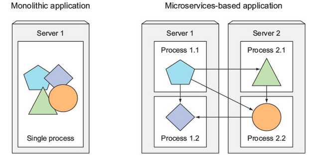

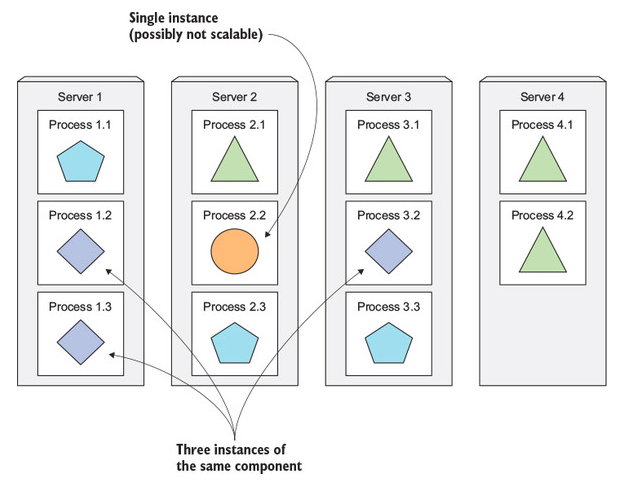

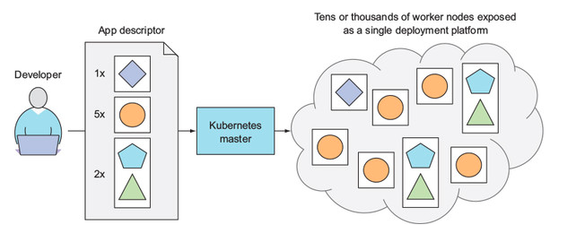

## Architecture

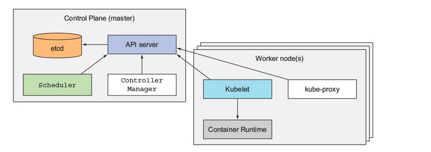

Components:
1. API server: communication for developers and other components
2. Scheduler: app scheduler - schedule resource allocation
3. Control manager: cluster-level functions: replicating components, track worker nodes, handling node failures etc
4. [etcd](https://etcd.io/): distributed state and config storage, part of coreos (alt zookeeper)
5. Container runtime: deprecated [docker](https://docs.docker.com/get-docker/) moved to [CRI](https://kubernetes.io/blog/2016/12/container-runtime-interface-cri-in-kubernetes/), supports [containerd](https://containerd.io/) and [CRIO](https://cri-o.io/)
6. Kubelet: local container manager, sync with api server
7. kube-proxy: handles network routing for containers

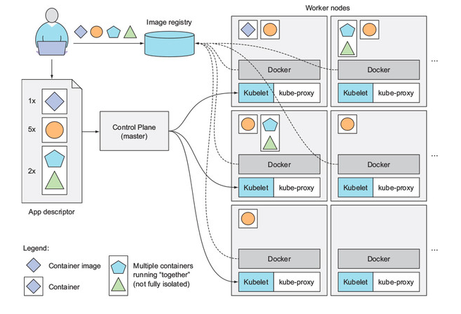

Handles 4 basic resources:

1. Compute
2. Memory
3. Storage
4. Network

## Pod

Pod is a co-located group of containers and represents the basic building block in Kubernetes.

Mostly, a pod = a container.
Actual usage of pods containing multiple containers in very niche usecases like container placement constraints:
- Sharing network interface & ip address
- Sharing hostname
- IPC / unix socket communication
- Filesystem isolation
- Functions as a scaling unit

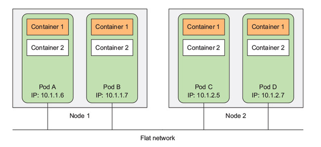

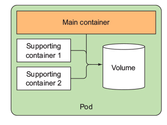

## Service

Concept introduced to group pods providing similar services for networking & service discovery.

- Single IP address & port
- Routing and hostname resolution
- Connect to external load balancers

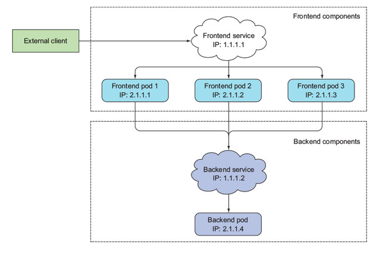

Application layer routing:

1. NodePort
   1. Reserve a port across all nodes
   2. All nodes running service can be used
2. LoadBalancer
   1. Use ELB
3. Ingress controller
   1. Global nginx + ELB

## Persistence

- Cloud
  - EBS
  - EFS
- `persistentVolumeClaim`
  - pre-provisioned
  - local
- `configMap`
- `secret`
- Git repo etc
  - wtf

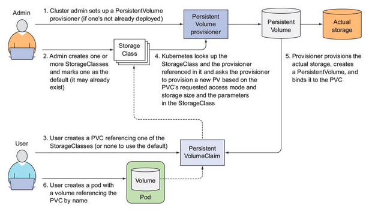

## ENV vars, Configmaps, secrets

ENV vars: pod definitions

Configmaps:
- storage for key-value pairs
- meant for configuration storage
- treated as a volume
- passed to containers as env vars
- can be passed as command line arg or file

Secrets:
- storage for key-value pairs
- same as configmaps
- encrypted

Image pull secrets:
- same as secrets
- used to pull container images from external services

## Deployment

Supports multiple deployment patterns:

- Rolling
- Blue-green
- Canary

## Orchestration

Supports various replica sets

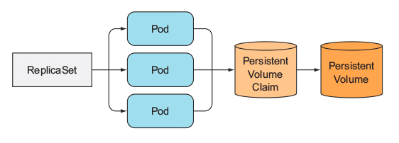

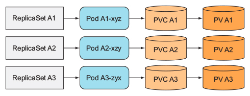

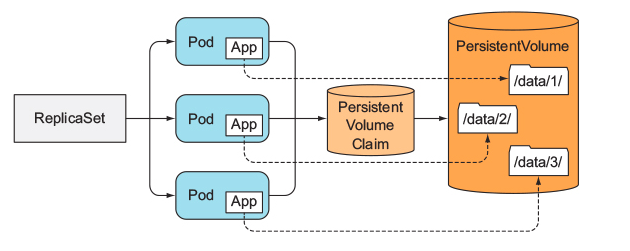

## Hands-on

### 1. Download and install kind

Arch / Manjaro:

```bash
yay -Ss aur/kind-bin
```

Other Linux:

```bash
curl -Lo ./kind https://kind.sigs.k8s.io/dl/v0.10.0/kind-linux-amd64
chmod +x ./kind
mv ./kind /usr/bin/kind
```

Mac:

```bash
brew install kind
```

Windows:

```bash
🙂
```

### 2. Use kind to bootstrap a local kubernetes cluster

```bash
kind create cluster
```

```bash
Creating cluster "kind" ...
 ✓ Ensuring node image (kindest/node:v1.19.1) 🖼
 ✓ Preparing nodes 📦
 ✓ Writing configuration 📜
 ✓ Starting control-plane 🕹️
 ✓ Installing CNI 🔌
 ✓ Installing StorageClass 💾
Set kubectl context to "kind-kind"
You can now use your cluster with:

kubectl cluster-info --context kind-kind

Not sure what to do next? 😅  Check out https://kind.sigs.k8s.io/docs/user/quick-start/
```

### 3. See status of cluster and confirm it is running

```bash
kubectl cluster-info --context kind-kind

kind get clusters
```

### 4. Get a docker-compose file

Generate an arda project:

```bash
export project_name=diamondhands
export project_title="Diamond hands :diamond:"
export project_description="Forever HODLer"

export db_name=gold
export db_username=diamond
export db_password=password

make new
cd diamondhands
# You should have a docker-compose.yml file here
```

Modify as per docker v3 specs.

Or use this:

```yaml
version: "3"

services:
  primary-db:
    image: postgres:12-alpine
    env_file:
      - ./env-sandbox/db.env
    ports:
      - "5432:5432"
    volumes:
      - primary-db-data:/var/lib/postgresql/data
    deploy:
      mode: replicated
      replicas: 1
      resources:
        limits:
          cpus: '0.001'
          memory: 1024M
        reservations:
          cpus: '0.001'
          memory: 512M
    labels:
      kompose.service.type: "clusterip"

volumes:
  primary-db-data:
```

```bash
mkdir env-sandbox
touch env-sandbox/db.env
```

```
POSTGRES_PASSWORD=${PGPASSWORD}
POSTGRES_USER=${PGUSER}
POSTGRES_DB=${PGDATABASE}
```

Or fetch your own docker-compose v3 file.

### 5. Create namespace

```yaml
apiVersion: v1
kind: Namespace
metadata:
  name: ktest
```

Store as `namespace.yaml`.

### 5. Prepare kubectl

```bash
KUBECTL='kubectl --namespace ktest'
# KUBECTL='kubectl --dry-run=client'
$KUBECTL apply -f ./namespace.yml

export PROJECT_NAME=diamondhands
export ENVIRONMENT=sandbox
```

### 6. Generate kubernetes resource files

```bash
mkdir kubernetes
cd kubernetes
kompose convert --error-on-warning --provider kubernetes -c -f ../docker-compose.yml
kompose convert --error-on-warning --provider kubernetes -f ../docker-compose.yml
```

Set some default options to false:

```bash
for pod in *-pod.yaml; do
    yq -y '.spec.enableServiceLinks = false' $pod > tmp
    mv tmp $pod
done
```

### 7. Create configmaps

Format all envs into a directory `.env`.

```bash
for filename in env-*; do
  CFG_NAME=$(echo $filename | cut -d '.' -f 1)
  $KUBECTL create configmap --from-env-file ./${filename} env-${ENVIRONMENT}-${CFG_NAME}-env || true
done
```

```bash
$KUBECTL create configmap --from-env-file ./db.env env-sandbox-db-env
```

### 8. Create secret if pulling image from external sources

```
cd ..
```

ECR:

```bash
export ENVIRONMENT=sandbox
export AWS_ACCOUNT_ID=1
export AWS_DEFAULT_REGION=ap-south-1

PASS=$(aws ecr get-login-password --region $AWS_DEFAULT_REGION)

$KUBECTL create secret docker-registry $ENVIRONMENT-aws-ecr-$AWS_DEFAULT_REGION \
  --docker-server=$AWS_ACCOUNT_ID.dkr.ecr.$AWS_DEFAULT_REGION.amazonaws.com \
  --docker-username=AWS \
  --docker-password=$PASS \
  --docker-email=lel@lol.com --namespace ktest
```

Quay:

```bash
EXISTS=$($KUBECTL get secret "quay.io" | tail -n 1 | cut -d ' ' -f 1)
if [ "$EXISTS" != "quay.io" ]; then
  $KUBECTL create secret docker-registry quay.io \
    --docker-server=quay.io \
    --docker-username=setuinfra+your-bot-name \
    --docker-password=get-your-won-key \
    --docker-email=lel@lol.com --namespace ktest
fi
```

### 8. Deploy resources

```bash
$KUBECTL apply -f ./kubernetes/ --namespace ktest
```

## kubectl Cheatsheet in zsh

https://kubernetes.io/docs/reference/kubectl/cheatsheet/

```bash
alias k="kubectl"
source <(kubectl completion zsh)
source <(kompose completion zsh)
alias k_services="k get services --sort-by=.metadata.name --all-namespaces"
alias k_pods="k get pods --all-namespaces -o wide"
alias k_restart="k get pods --all-namespaces --sort-by='.status.containerStatuses[0].restartCount'"
alias k_volumes="k get pv --all-namespaces --sort-by=.spec.capacity.storage"
alias k_running="k get pods --all-namespaces --field-selector=status.phase=Running"
alias k_nodes="k get nodes --all-namespaces"
alias k_shell="k exec --stdin --tty $POD -- /bin/sh"
alias k_events="k get events --watch --all-namespaces"
alias k_secrets="k get secrets --all-namespaces"
alias k_configs="k get configMaps --all-namespaces"
alias k_context="k config current-context"
alias k_set_context="k config use-context "
alias k_images="kubectl get pods --all-namespaces -o jsonpath="{..image}" |\
tr -s '[[:space:]]' '\n' |\
sort |\
uniq -c"
```

# Docs

## Kubernetes local setup 💻

https://kubernetes.io/docs/tasks/tools/
https://kind.sigs.k8s.io/docs/user/quick-start/

## Translate docker compose to helm 🆎

https://kubernetes.io/docs/tasks/configure-pod-container/translate-compose-kubernetes/
https://kompose.io/user-guide/

## Docker compose v3 specs 🗒️

https://docs.docker.com/compose/compose-file/compose-file-v3/#links
https://kubernetes.io/docs/concepts/services-networking/service/#publishing-services-service-types

## Load balancer and ingress controllers ☸️

https://medium.com/google-cloud/kubernetes-nodeport-vs-loadbalancer-vs-ingress-when-should-i-use-what-922f010849e0
https://stackoverflow.com/questions/45079988/ingress-vs-load-balancer
https://github.com/Kong/kubernetes-ingress-controller
https://docs.konghq.com/kubernetes-ingress-controller/1.1.x/guides/getting-started/
https://kubernetes.github.io/ingress-nginx/

## Config Management 🗒️

https://kubernetes.io/docs/concepts/configuration/configmap/

## Secrets ☣️

https://kubernetes.io/docs/concepts/configuration/secret/

## Databases 💾

https://cloud.google.com/blog/products/databases/to-run-or-not-to-run-a-database-on-kubernetes-what-to-consider

## Best practices ✨

https://cloud.google.com/blog/products/containers-kubernetes/your-guide-kubernetes-best-practices
https://techbeacon.com/devops/one-year-using-kubernetes-production-lessons-learned

## Debugging 😭

- https://kubernetes.io/docs/tasks/debug-application-cluster/debug-service/
- Shell: https://kubernetes.io/docs/tasks/debug-application-cluster/get-shell-running-container/
- For running containers: https://kubernetes.io/docs/tasks/debug-application-cluster/debug-running-pod/#container-exec
- For stopped containers: https://kubernetes.io/docs/tasks/debug-application-cluster/debug-running-pod/#ephemeral-container
- Extensions: https://github.com/aylei/kubectl-debug#install-the-kubectl-debug-plugin

Stopped container debugging:
Override the default troubleshooting image
```bash
kubectl debug POD_NAME --image aylei/debug-jvm
```

Override entrypoint of debug container
```bash
kubectl debug POD_NAME --image aylei/debug-jvm /bin/bash
```

## Alternatives 😒

- ECS
- Docker swarm
- Nomad + Consul
